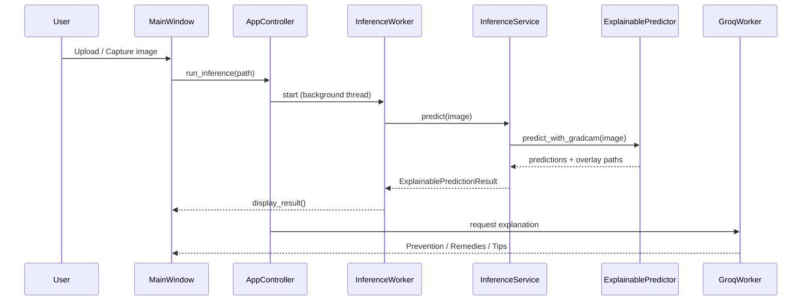

# PlantDiseaseAI — System Architecture

## Overview

PlantDiseaseAI is a modular, crop-configurable machine learning system with a PySide6 desktop front-end. Each crop (grape, tomato) is defined by YAML configuration; the same inference and UI code paths serve all crops without hard-coded class lists.

```
┌─────────────────────────────────────────────────────────────────┐
│                     Desktop Application (PySide6)                │
│  Header → Images → Prediction → AI Tips → Controls              │
└────────────────────────────┬────────────────────────────────────┘
                             │
                    AppController
                             │
         ┌───────────────────┼───────────────────┐
         ▼                   ▼                   ▼
   ModelManager      InferenceService    GroqExplanationService
         │                   │                   │
         ▼                   ▼                   ▼
   load_config()    ExplainablePredictor   Groq API (optional)
                             │
              ┌──────────────┼──────────────┐
              ▼              ▼              ▼
         Predictor       Grad-CAM      Image I/O
              │              │
              ▼              ▼
      EfficientNet-B0   Heatmap overlay
      (PyTorch CPU/GPU)
```

## Layer Breakdown

### 1. Presentation Layer — `desktop_app/`

| Component | Path | Responsibility |
|-----------|------|----------------|
| Entry point | `app.py` | Qt application bootstrap, platform overrides |
| Main window | `ui/main_window.py` | Layout, widget wiring, result display |
| Controller | `controllers/app_controller.py` | Upload/capture/crop/language events |
| Inference service | `services/inference_service.py` | UI-facing predict API |
| Model manager | `services/model_manager.py` | Per-crop model cache |
| Camera service | `services/camera_service.py` | OpenCV + picamera2 backends |
| Groq service | `services/groq_service.py` | LLM explanations with session cache |
| Workers | `services/workers.py` | Background threads (load, infer, Groq) |
| i18n | `i18n/translator.py` | JSON translations (en, hi, mr) |

**UI flow:**

1. User selects crop → `ModelManager` loads or retrieves cached weights.
2. User uploads or captures image → `InferenceWorker` runs `predict_with_gradcam`.
3. Results render: original image, Grad-CAM overlay, top-3 predictions.
4. `GroqWorker` fetches Prevention / Remedies / Tips (if API key configured).

### 2. Inference Layer — `inference/`

| Module | Purpose |
|--------|---------|
| `predictor.py` | Core prediction — PyTorch / TorchScript / ONNX backends |
| `explainable_predictor.py` | Wraps predictor + optional Grad-CAM generation |
| `gradcam.py` | Grad-CAM heatmap and overlay export |

**Prediction pipeline:**

```
Image → EXIF fix / RGB load → Albumentations normalize → EfficientNet-B0
     → Softmax → Top-K classes → (optional) Grad-CAM for top-1 class
```

### 3. Model Layer — `models/`

| Module | Purpose |
|--------|---------|
| `factory.py` | Builds EfficientNet-B0 or MobileNetV3 with correct `num_classes` |

Weights and class mappings are resolved from crop YAML:

```yaml
inference:
  weights_path: weights/grape/best_model.pth
  class_names_path: datasets/grape/reports/class_mapping.json
  image_size: 224
  num_classes: 4
```

### 4. Training Layer — `training/`

| Module | Purpose |
|--------|---------|
| `trainer.py` | Generic training loop (AMP, early stopping, TensorBoard) |
| `tomato_trainer.py` | Tomato-specific training with class weights |
| `dataset.py` | PyTorch `Dataset` over folder-per-class layout |
| `transforms.py` | Albumentations train/val pipelines |
| `metrics_utils.py` | Accuracy, F1, confusion matrix helpers |

### 5. Preprocessing Layer — `preprocessing/`

Crop-specific pipelines built on shared validators:

| Crop | Pipelines |
|------|-----------|
| Grape | `pipeline.py` — audit, dedupe, stratified split |
| Tomato | `tomato_raw_pipeline.py`, `tomato_split_pipeline.py`, `tomato_balance_pipeline.py` |
| Potato | `audit_potato_dataset.py` (audit only) |

Shared utilities: duplicate detection (perceptual hash), leaf map validation, stratified splitting.

### 6. Configuration Layer — `configs/` + `utils/config.py`

```
configs/base.yaml              # Global defaults
        ↓ merge
configs/crops/{crop}.yaml      # Classes, paths, training/inference overrides
        ↓ merge (if Raspberry Pi detected)
configs/platform/raspberry_pi.yaml
```

`AppConfig` exposes dot-notation access (`config.get("inference.image_size")`) and path resolution relative to project root.

**Runtime paths** (`utils/runtime_paths.py`):

- Development: project root = repository folder
- PyInstaller exe: project root = exe directory or `_MEIPASS` bundle

### 7. Platform Layer — `utils/platform.py`

| Detection | Behavior |
|-----------|----------|
| Raspberry Pi (ARM + device tree) | Loads `raspberry_pi.yaml` — CPU, picamera2 camera, Grad-CAM off |
| Windows / Linux desktop | CUDA if available, OpenCV webcam |
| PyInstaller frozen | Bundled configs + post-copy weights |

## Data Flow — Inference Request



## Multi-Crop Design

Adding a new crop requires **no code changes** to the desktop app:

1. Create `configs/crops/{crop}.yaml` with classes and paths.
2. Train model → save to `weights/{crop}/best_model.pth`.
3. Export `datasets/{crop}/reports/class_mapping.json`.
4. Add crop name to `ControlsBar` crop combo (UI label only).

`ModelManager` hot-swaps models when the user changes crop in the dropdown.

## Deployment Architectures

### Windows Desktop (PyInstaller)

```
dist/PlantDiseaseAI/
├── PlantDiseaseAI.exe
├── _internal/          # Python runtime + torch + PySide6
├── configs/
├── weights/
├── resources/
└── datasets/           # class_mapping.json only
```

Build: `python scripts/build_exe.py`

### Raspberry Pi

- **Runtime:** Python venv + `requirements-raspberry-pi.txt`
- **Device:** CPU-only PyTorch wheel
- **Camera:** picamera2 (Pi Camera Module) → fallback OpenCV V4L2 (USB webcam)
- **Performance:** Grad-CAM disabled by default; prediction ~5–20 s on Pi 4

Setup: `scripts/setup_raspberry_pi.sh`

## External Dependencies

| Dependency | Role |
|------------|------|
| PyTorch / torchvision | Model inference and training |
| PySide6 | Desktop GUI |
| OpenCV | Image I/O, webcam capture |
| Albumentations | Inference and training transforms |
| Groq API | Optional natural-language disease guidance |
| picamera2 | Raspberry Pi Camera Module (Pi only) |

## Security Notes

- `.env` contains `GROQ_API_KEY` — never commit to git.
- Model weights are local files; no cloud inference required for predictions.
- Groq calls send crop name, prediction, and language — not raw images (by default).

## Reports and Evaluation Artifacts

Generated reports live in `reports/` and `datasets/{crop}/reports/`:

- Dataset audits, split summaries, balancing logs
- Confusion matrices, misclassified samples
- Runtime verification and integration test outputs

These document model quality and pipeline correctness; they are not required at runtime.

## Future Extension Points

| Extension | Location |
|-----------|----------|
| New crop | `configs/crops/`, train script, combo box label |
| New backbone | `models/factory.py` |
| ONNX / edge deployment | `exports/`, `inference/predictor.py` backend switch |
| Potato production | Complete preprocessing → train → add to `ControlsBar` |
| Cloud / mobile UI | Reuse `InferenceService` API without Qt layer |
